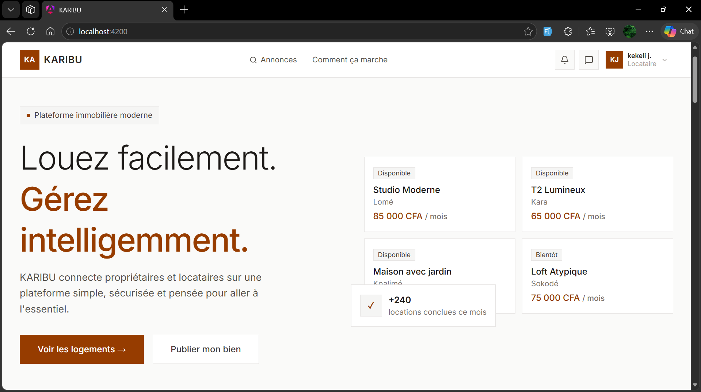
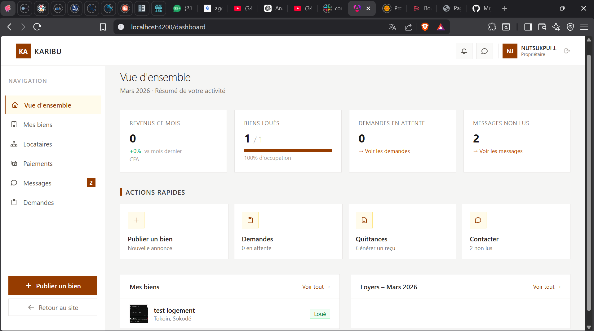
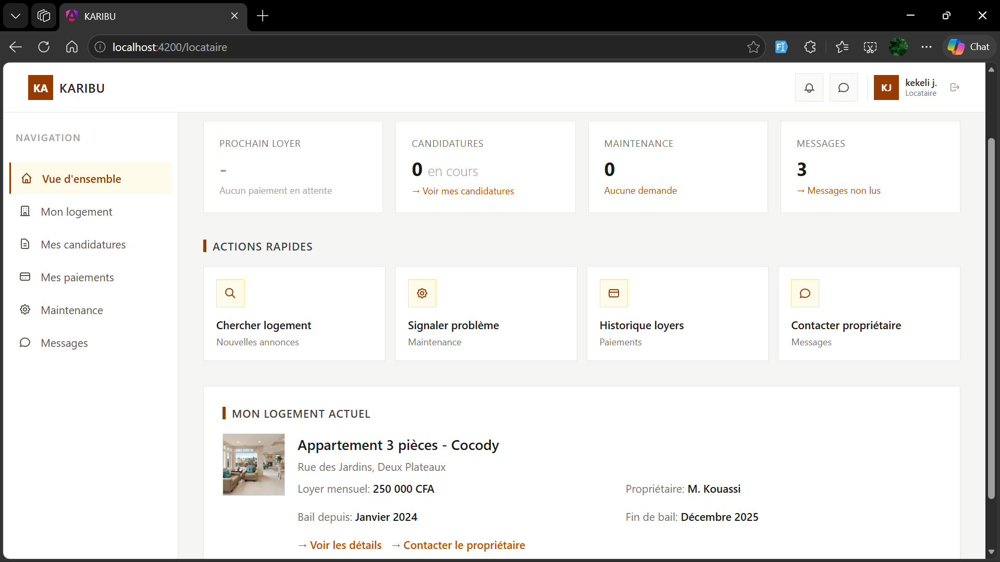
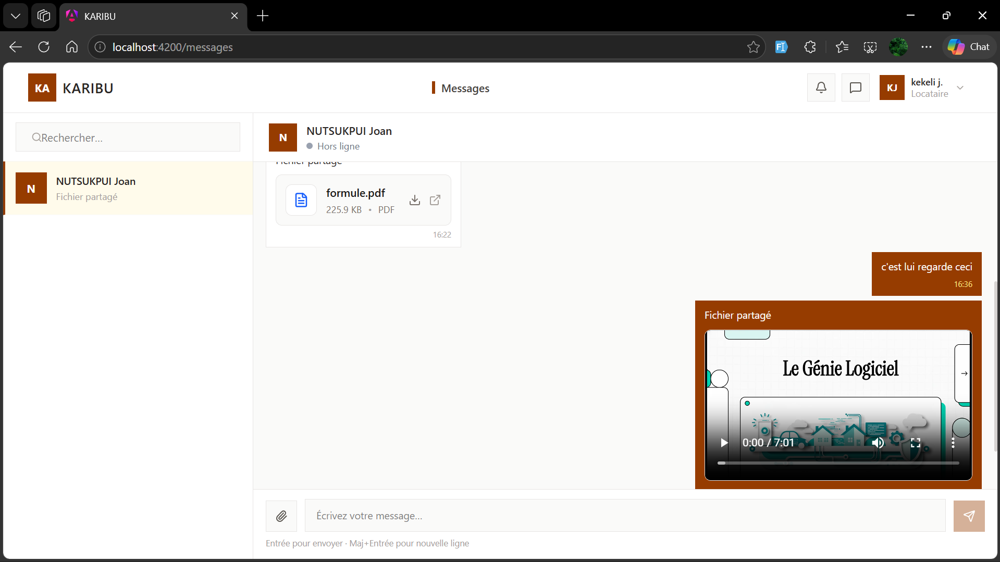
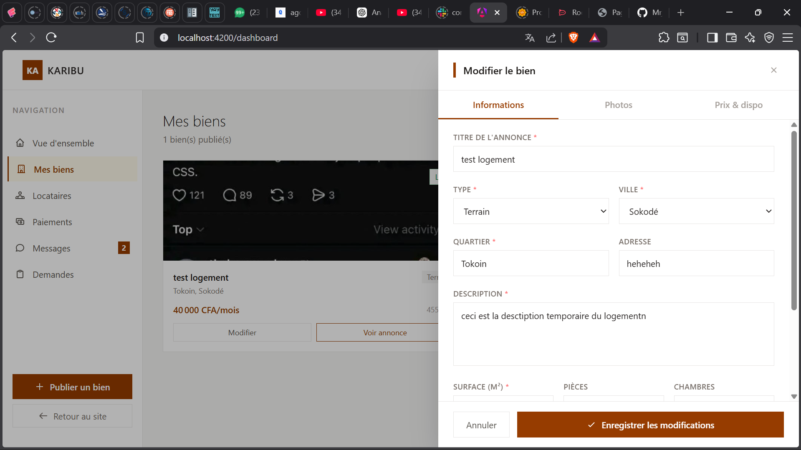
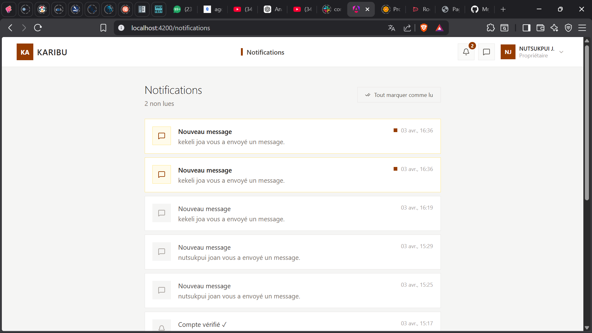

# Karibu Frontend

Interface utilisateur moderne pour la plateforme de gestion immobilière Karibu. Application Angular 18 avec Tailwind CSS offrant une expérience utilisateur fluide et responsive pour propriétaires et locataires.



## Table des matières

- [Aperçu](#aperçu)
- [Fonctionnalités](#fonctionnalités)
- [Architecture](#architecture)
- [Technologies](#technologies)
- [Installation](#installation)
- [Configuration](#configuration)
- [Développement](#développement)
- [Composants](#composants)
- [Captures d'écran](#captures-décran)
- [Déploiement](#déploiement)
- [Contributeurs](#contributeurs)

## Aperçu

Le frontend Karibu est une application Angular single-page qui consomme l'API REST Django. Elle offre des interfaces distinctes et optimisées pour les propriétaires et locataires, avec un système de messagerie temps réel et une gestion complète des propriétés immobilières.

### Caractéristiques principales

- Interface responsive (mobile-first)
- Authentification JWT sécurisée
- Messagerie temps réel avec WebSockets
- Upload et prévisualisation de fichiers
- Tableaux de bord interactifs
- Design system cohérent avec Tailwind CSS

## Fonctionnalités

### Interface Propriétaire

- **Dashboard Analytics** : Métriques financières et statistiques
- **Gestion Propriétés** : CRUD complet avec galerie photos
- **Suivi Locataires** : Profils et historiques détaillés
- **Validation Paiements** : Interface d'escrow intuitive
- **Chat Intégré** : Communication directe avec locataires

### Interface Locataire

- **Vue d'ensemble** : Résumé location et paiements
- **Historique Paiements** : Timeline détaillée avec reçus
- **Mes Candidatures** : Suivi des demandes en cours
- **Demandes Maintenance** : Signalement avec photos
- **Messagerie** : Chat temps réel avec propriétaire

### Fonctionnalités Transversales

- **Authentification** : Login/Register avec gestion de session
- **Notifications** : Alertes temps réel
- **Upload Fichiers** : Drag & drop avec prévisualisation
- **Responsive Design** : Adaptatif mobile/tablet/desktop
- **Dark Mode** : Support mode sombre (à venir)

## Architecture

```
src/
├── app/
│   ├── components/          # Composants de l'application
│   │   ├── auth/           # Authentification
│   │   ├── dashboard/      # Tableaux de bord
│   │   ├── tenant/         # Interface locataire
│   │   ├── proprietaire/   # Interface propriétaire
│   │   └── shared/         # Composants partagés
│   ├── services/           # Services Angular
│   │   ├── auth.service.ts
│   │   ├── tenant.service.ts
│   │   ├── chat.service.ts
│   │   └── api.service.ts
│   ├── guards/             # Gardes de route
│   │   ├── auth.guard.ts
│   │   └── role.guard.ts
│   ├── shared/             # Modules partagés
│   │   ├── components/     # Composants réutilisables
│   │   └── services/       # Services utilitaires
│   └── environments/       # Configuration environnements
├── assets/                 # Resources statiques
│   ├── images/
│   └── icons/
└── styles/                # Styles globaux
    ├── components/        # Styles composants
    └── utilities/         # Classes utilitaires
```

## Technologies

### Core Framework
- **Angular** : 18.x (dernière version stable)
- **TypeScript** : 5.x pour le type safety
- **RxJS** : 7.x pour la programmation réactive
- **Angular Signals** : Gestion d'état moderne

### Styling & UI
- **Tailwind CSS** : 3.x Framework CSS utility-first
- **Lucide Angular** : Icônes modernes et cohérentes
- **Angular CDK** : Composants et utilities avancés
- **CSS Grid & Flexbox** : Layouts responsifs

### Networking & Real-time
- **Angular HttpClient** : Communication API REST
- **WebSockets** : Messagerie temps réel
- **Socket.io Client** : Client WebSocket robuste
- **RxJS WebSocketSubject** : Stream WebSocket réactif

### Development Tools
- **Angular CLI** : Tooling et génération de code
- **ESLint** : Linting et qualité de code
- **Prettier** : Formatage automatique
- **Angular DevTools** : Debugging et profiling

## Installation

### Prérequis

- Node.js 18.x ou supérieur
- npm 9.x ou supérieur
- Angular CLI 18.x

### Setup rapide

```bash
# Clone du projet
git clone <repository-url>
cd ImmoManager

# Installation des dépendances
npm install

# Installation globale d'Angular CLI (si nécessaire)
npm install -g @angular/cli@latest

# Vérification de la version
ng version

# Lancement du serveur de développement
ng serve
```

### Installation détaillée

```bash
# Vérification de Node.js
node --version  # Doit être >= 18.x
npm --version   # Doit être >= 9.x

# Installation des dépendances du projet
npm ci  # Installation propre depuis package-lock.json

# Installation des outils de développement
npm install --save-dev @angular-devkit/build-angular
npm install --save-dev @angular/cli

# Génération des types TypeScript (si nécessaire)
npm run build
```

## Configuration

### Environnements

Modifier les fichiers dans `src/environments/` :

**environment.ts (Développement)**
```typescript
export const environment = {
  production: false,
  apiUrl: 'http://127.0.0.1:8000/api',
  wsUrl: 'ws://127.0.0.1:8000',
  appName: 'Karibu Dev',
  version: '1.0.0-dev'
};
```

**environment.prod.ts (Production)**
```typescript
export const environment = {
  production: true,
  apiUrl: 'https://api.karibu.com/api',
  wsUrl: 'wss://api.karibu.com',
  appName: 'Karibu',
  version: '1.0.0'
};
```

### Configuration Tailwind

Le fichier `tailwind.config.js` contient la configuration custom :

```javascript
module.exports = {
  content: ['./src/**/*.{html,ts}'],
  theme: {
    extend: {
      colors: {
        primary: {
          50: '#fef7ee',
          500: '#f59e0b',
          600: '#d97706',
          700: '#b45309'
        }
      }
    }
  }
};
```

## Développement

### Commandes utiles

```bash
# Serveur de développement
ng serve                    # Port 4200
ng serve --port 3000       # Port custom
ng serve --host 0.0.0.0    # Accès réseau

# Build
ng build                   # Build développement
ng build --prod           # Build production
ng build --watch          # Build avec watch mode

# Tests
ng test                    # Tests unitaires (Karma/Jasmine)
ng e2e                     # Tests end-to-end (Cypress)

# Génération de code
ng generate component nom-component
ng generate service nom-service
ng generate guard nom-guard
ng generate module nom-module

# Linting et formatage
ng lint                    # ESLint
npm run format            # Prettier
```

### Structure des composants

Convention de nommage et organisation :

```bash
# Génération d'un nouveau composant
ng generate component components/shared/custom-button

# Structure générée
src/app/components/shared/custom-button/
├── custom-button.component.html
├── custom-button.component.scss
├── custom-button.component.spec.ts
└── custom-button.component.ts
```

### Services et injection

Pattern de services utilisé dans le projet :

```typescript
// Service exemple
@Injectable({
  providedIn: 'root'
})
export class TenantService {
  private apiUrl = environment.apiUrl;
  
  // Utilisation de Signals
  overview = signal<TenantOverview | null>(null);
  isLoading = signal(false);
  
  constructor(private http: HttpClient) {}
  
  loadOverview(): Observable<TenantOverview> {
    this.isLoading.set(true);
    return this.http.get<TenantOverview>(`${this.apiUrl}/tenant/overview/`);
  }
}
```

## Composants

### Composants principaux

| Composant | Description | Path |
|-----------|-------------|------|
| `AuthComponent` | Authentification utilisateur | `components/auth/` |
| `DashboardComponent` | Tableau de bord principal | `components/dashboard/` |
| `TenantDashboardComponent` | Interface locataire complète | `components/tenant-dashboard/` |
| `ChatComponent` | Messagerie temps réel | `components/shared/chat/` |
| `PropertyListComponent` | Liste des propriétés | `components/proprietaire/properties/` |

### Composants partagés

| Composant | Description | Utilisation |
|-----------|-------------|-------------|
| `LoaderComponent` | Indicateur de chargement | Toute l'app |
| `ToastComponent` | Notifications toast | Messages système |
| `ModalComponent` | Boîtes de dialogue | Confirmations |
| `FileUploadComponent` | Upload de fichiers | Chat, propriétés |
| `DatePickerComponent` | Sélecteur de dates | Formulaires |

## Captures d'écran

### Dashboard Propriétaire



### Dashboard Locataire

**

### Interface Chat Desktop




### Gestion des Propriétés



### Système de Notifications




## Déploiement

### Build de production

```bash
# Build optimisé pour production
ng build --prod

# Le dossier dist/ contient les fichiers à déployer
ls dist/immo-manager/
```

### Variables d'environnement

Pour le déploiement, configurer :

```bash
# Variables d'environnement
API_URL=https://api.karibu.com/api
WS_URL=wss://api.karibu.com
NODE_ENV=production
```

### Serveur web

Configuration nginx exemple :

```nginx
server {
    listen 80;
    server_name karibu.com;
    
    root /var/www/karibu/dist/immo-manager;
    index index.html;
    
    # Angular routing
    location / {
        try_files $uri $uri/ /index.html;
    }
    
    # Assets avec cache long
    location /assets/ {
        expires 1y;
        add_header Cache-Control "public, immutable";
    }
}
```

## Contributeurs


**Karibu Frontend** - Modern Real Estate Management Interface

Pour questions techniques frontend, contactez l'équipe de développement Angular.
```

Once the server is running, open your browser and navigate to `http://localhost:4200/`. The application will automatically reload whenever you modify any of the source files.

## Code scaffolding

Angular CLI includes powerful code scaffolding tools. To generate a new component, run:

```bash
ng generate component component-name
```

For a complete list of available schematics (such as `components`, `directives`, or `pipes`), run:

```bash
ng generate --help
```

## Building

To build the project run:

```bash
ng build
```

This will compile your project and store the build artifacts in the `dist/` directory. By default, the production build optimizes your application for performance and speed.

## Running unit tests

To execute unit tests with the [Vitest](https://vitest.dev/) test runner, use the following command:

```bash
ng test
```

## Running end-to-end tests

For end-to-end (e2e) testing, run:

```bash
ng e2e
```

Angular CLI does not come with an end-to-end testing framework by default. You can choose one that suits your needs.

## Additional Resources

For more information on using the Angular CLI, including detailed command references, visit the [Angular CLI Overview and Command Reference](https://angular.dev/tools/cli) page.
